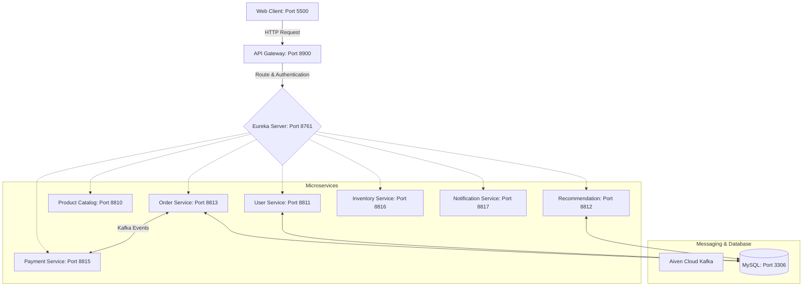

# Hệ Thống Microservices Thương Mại Điện Tử - Rainbow Forest 🌈

Hệ thống E-Commerce được xây dựng trên kiến trúc **Spring Cloud Microservices** hiện đại, tích hợp **Aiven Cloud Kafka** để xử lý các sự kiện không đồng bộ và bảo mật toàn diện bằng **JWT & BCrypt Password Encoder**.

---

## 🗺️ Kiến Trúc Hệ Thống & Cổng Dịch Vụ

Hệ thống bao gồm các microservices được đăng ký và định tuyến qua Eureka và API Gateway:



### Danh Sách Cổng (Ports) & Nhiệm Vụ:
* **Eureka Server** (`8761`): Đăng ký và quản lý khám phá dịch vụ (Service Discovery).
* **API Gateway** (`8900`): Định tuyến động, xử lý CORS, kiểm tra token JWT tại bộ lọc `JwtAuthenticationFilter`.
* **User Service** (`8811`): Quản lý tài khoản, mã hóa mật khẩu bằng BCrypt, khóa/mở khóa tài khoản.
* **Product Catalog Service** (`8810`): Quản lý danh mục sản phẩm (H2 database).
* **Product Recommendation Service** (`8812`): Đánh giá sản phẩm, gợi ý mua sắm (MySQL database).
* **Order Service** (`8813`): Quản lý giỏ hàng (in-memory mock Redis) và tạo đơn hàng (MySQL database).
* **Payment Service** (`8815`): Giả lập và xử lý thanh toán đơn hàng (H2 database).
* **Inventory Service** (`8816`): Quản lý kho hàng (H2 database).
* **Notification Service** (`8817`): Thu thập sự kiện và ghi vết thông báo hệ thống.
* **Web Client** (`5500`): Giao diện người dùng và Admin Panel (HTML/CSS/JS thuần).

---

## 🛠️ Công Nghệ Sử Dụng

* **Core**: Java 21, Spring Boot 3.2.4, Spring Cloud 2023.0.0 (Gateway, Eureka, OpenFeign)
* **Bảo mật**: Spring Security, JWT Token, BCrypt Password Encoder
* **Truyền thông điệp (Messaging)**: **Aiven Cloud Kafka** sử dụng cơ chế bảo mật **SASL_SSL** (SCRAM-SHA-256) và xác thực chứng chỉ SSL qua Truststore.
* **Cơ sở dữ liệu**: MySQL 8.0 (phục vụ dữ liệu người dùng, đơn hàng, đề xuất) và H2 Database (in-memory phục vụ catalog, thanh toán, kho).

---

## 🔄 Luồng Sự Kiện Đặt Hàng E2E (Kafka Events)

Quy trình thanh toán hoạt động hoàn toàn tự động và không đồng bộ thông qua các topic Kafka trên đám mây:

1. **Tạo Đơn Hàng**: Khi người dùng nhấn nút đặt hàng từ Web Client, một yêu cầu `POST /api/shop/order/{userId}` được gửi tới `order-service`. Đơn hàng được lưu lại với trạng thái mặc định là `PAYMENT_EXPECTED`.
2. **Phát Sự Kiện OrderCreated**: `order-service` phát sự kiện `OrderCreatedEvent` lên topic `order-created` của Aiven Kafka.
3. **Thanh Toán**: 
   * `payment-service` lắng nghe từ topic `order-created`, ghi nhận thông tin thanh toán thành công và lưu lịch sử.
   * Đồng thời, phát sự kiện `PaymentCompletedEvent` lên topic `payment-completed`.
4. **Cập Nhật Đơn Hàng**: `order-service` lắng nghe topic `payment-completed` và tự động cập nhật trạng thái đơn hàng tương ứng thành `PAID` trong MySQL.
5. **Đồng Bộ Khác**: `inventory-service` và `notification-service` cũng lắng nghe sự kiện trên các topic này để giảm trừ số lượng tồn kho và ghi nhật ký thông báo.

---

## 🚀 Hướng Dẫn Khởi Chạy Hệ Thống

### 1. Chuẩn bị Cơ sở dữ liệu MySQL
* Hãy đảm bảo MySQL đang chạy tại cổng `3306` của localhost.
* Chạy tập lệnh sau trong PowerShell để tạo các cơ sở dữ liệu và nạp dữ liệu mẫu:
  ```powershell
  Get-Content seed.sql | C:\xampp\mysql\bin\mysql.exe -u root
  ```

### 2. Biên dịch Dự án
* Chạy script biên dịch toàn bộ các microservices (sử dụng JDK 21):
  ```powershell
  Set-ExecutionPolicy Bypass -Scope Process
  .\build_all.ps1
  ```

### 3. Khởi chạy Các Microservices
* Chạy tất cả các dịch vụ ở chế độ chạy nền (background processes) và chuyển hướng log ra thư mục `\logs`:
  ```powershell
  .\run_all_background.ps1
  ```
  *(Hoặc chạy lệnh `.\run_all.ps1` để khởi chạy từng cửa sổ CMD riêng biệt).*

### 4. Khởi chạy Frontend Web Client
* Khởi động máy chủ web cục bộ tại cổng `5500`:
  ```powershell
  python -m http.server 5500
  ```

---

## 🧪 Kịch Bản Kiểm Thử & Xác Thực Hệ Thống

Dự án cung cấp sẵn tệp script PowerShell tự động kiểm thử toàn bộ luồng nghiệp vụ:
```powershell
.\verify_flow.ps1
```

### Kịch bản tự động bao gồm:
1. Đăng nhập tài khoản `johndoe` / `password123` để nhận mã JWT Token.
2. Thêm sản phẩm vào giỏ hàng và thực hiện Checkout đơn hàng.
3. Chờ 5 giây cho luồng Kafka lan truyền qua Aiven Cloud, sau đó kiểm tra trạng thái đơn hàng tự động chuyển sang `PAID`.
4. Đăng nhập tài khoản Admin (`janesmith` / `password456`).
5. Kiểm thử chức năng **Khóa tài khoản** người dùng `johndoe`, xác thực việc đăng nhập bị từ chối khi tài khoản bị khóa.
6. **Mở khóa tài khoản** và phục hồi trạng thái hoạt động của người dùng.
7. Lấy danh sách toàn bộ các đánh giá đề xuất và tiến hành xóa thử một đề xuất.

---

## 🖥️ Trải Nghiệm Giao Diện Người Dùng
* **Giao diện mua sắm**: [http://localhost:5500/index.html](http://localhost:5500/index.html) (Đăng nhập `johndoe` / `password123`)
* **Giao diện Admin Panel**: [http://localhost:5500/admin.html](http://localhost:5500/admin.html) (Đăng nhập `janesmith` / `password456` để quản trị sản phẩm, đơn hàng, khóa người dùng và quản lý đề xuất).
* **Eureka Dashboard**: [http://localhost:8761/](http://localhost:8761/)
